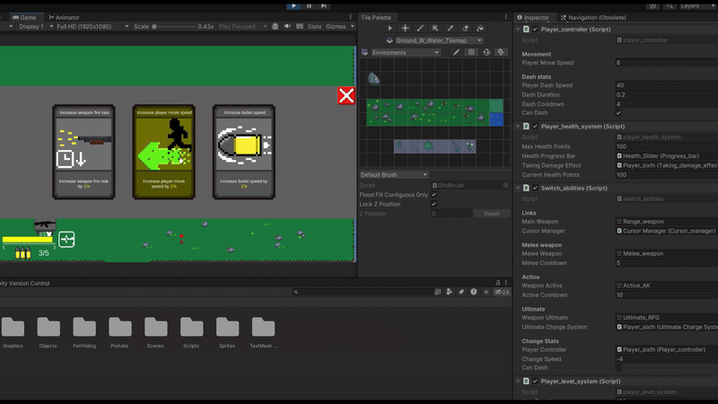

# Резюме

## Навыки и опыт в проектах.
Разработчик игр на Unity с опытом работы в коммерческом проекте, в составе не большой команды, а так же в личных проектах. Основными моими задачами в коммерческом проекте являлись: создание геймплейной логики, различные взаимодействия объектов, настройка поведения врагов и игрока, способности игрока, интеграция и синхронизация анимаций персонажей с логикой. Так же разрабатываю свои личные 2D проекты и публикую на платформу Яндекс Игры.
В своих системах делаю упор на гибкость, масштабируемость и переиспользование уже готовых компенентов.
### Навыки:
#### 1. Создание боевых логик, дальних и ближних атак.
#### 2. Использование NavMeshPlus и A*(A Star Pathfinding Project) для ИИ.
#### 3. Создание стейт машин, ретаргитинг анимаций и настройка 2D и 3D анимаций и сонхронизация их с логикой.
#### 4. Адаптиция управления под ПК и мобильные устройства.
#### 5. Работа с UI, создание полос здоровья, опыта, различных счетчиков(например монет), идндикаторы зарядов способностей и их готовности, простой инвентарь в формате "карусели".
#### 6. Использование PlayerPrefs для сохранения и загрузки данных игрока, например, количество монет собранных игроком и разблокированные скины.
#### 7. Навык использование SceneManager, например для перехода по уровням.
#### 8. Реализация контрольных точек для игрока и его продметов.
#### 9. Имею не большой опыт работы со звуком, например, фоновый звук и звуки при взаимодействии с предметами.
#### 10. Знаком с Profiler анализирующего потребление ресурсов системы.
#### 11. Часто использую ScriptableObject для реализации способностей, навыков, улучшений или зелий(эффектов) для игрока.
#### 12. Работа в команде через Git, GitHub и GitHub Desktop, и умение решать конфликты векток.
#### 13. Работа в команде используя UnityCloud.

# Примеры работ

## Система прокачки игрока во время геймплея с помощью карточек улучшений.

Эта система позволяет игроку за накопленные токены во время игры открыть и выбрать одно из трёх случайных улучшений потратив на это токен. Выбранные улучшения тут же применяются к игроку. Система так же умеет сохранять те карточки, которые выпали игроку при первом открытии окна улучшений. То есть если игрок открывает и закрывает окно не выбрав какую-либо карточку с улучшением, то при повторном открытии карточки остануться теми же и не подберуться новые, что защищает систему от игрока, который может постоянно перемешивать карточки в надежде найти лучшую.
### Примеры скриптов этой системы находятся в папке CardUpgradeSystem.

## Система магазина.

Эта система магазина позволяющая игроку не открывая UI магазина покупать предметы. Игрок подходит к стенду, на котором появляется случайный предмет, имеющий свой эффект, название, описание и цену. При приближении игрока к стенду, высвечавается информация о том предмете, который в нём расположен. Если у игрока достаточно игровой валюты, он можен приобрести предмет, после чего он отделяется от стенда и игрок можен его подобрать и использовать.

## Система инвентаря в формате "карусели".

Эта система позволяет хранить и отслеживать игроку найденные предметы. Подобранные предметы игрок видит у себя на экране в инвентаре, в формате, текущий - по центру, следующий - справа, предыдущий - слева. Игрок может переключаться между предметами инвентаря на кнопки Q и E, и использовать центральный(текущий предмет) на кнопку H и применить на себя эффект. Так же у предметов отображается их количество, а у центрального ещё и краткое описание.

## Система скинов.

Эта система использована в проекте опубликованном на платформе Яндекс Игры с подключенной рекламмой и монетизацией. Эта система позволяет игроку выбрать себе облик перед стартом геймплея просто переключившись на него. Стартовое меню и геймплей находятся на одной сцене, поэтому как только игрок переключается на разблокированный облик он его сразу применяет и может сразу перейти к геймплею. Если облик не открыт и игрок пытается начать с ним игру, то он при старте геймплея поменяется на предыдущий. Так же все разблокированные облики игрока сохраняются с помощью PlayerPrefs, что позволяет игроку в разных браузерных сессиях сохранять все свои открытые облики.
